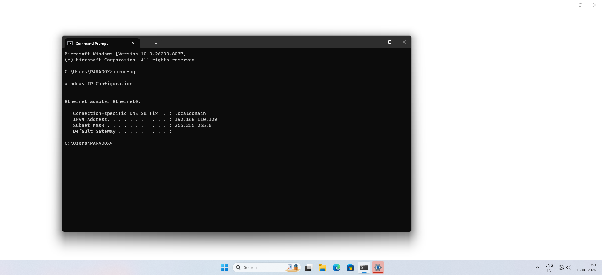
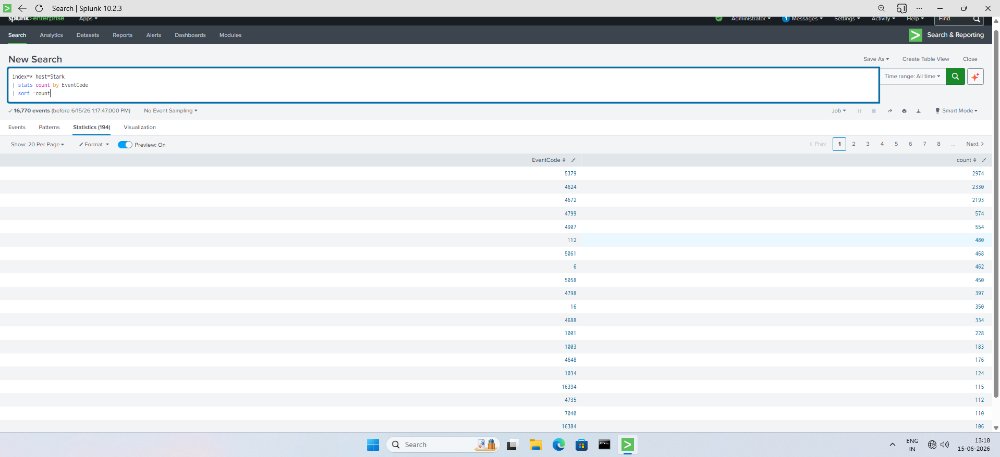
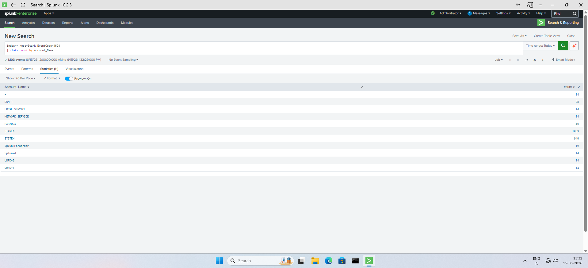
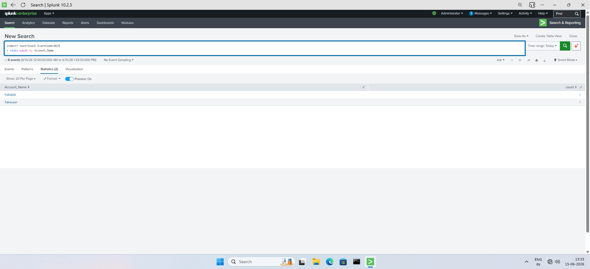
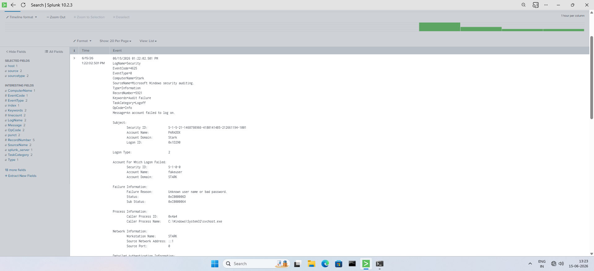
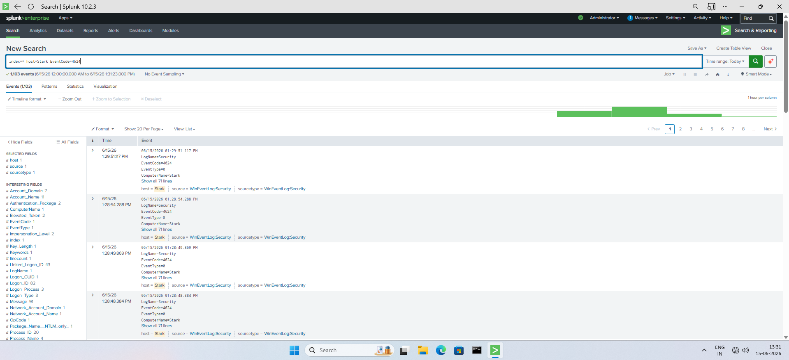
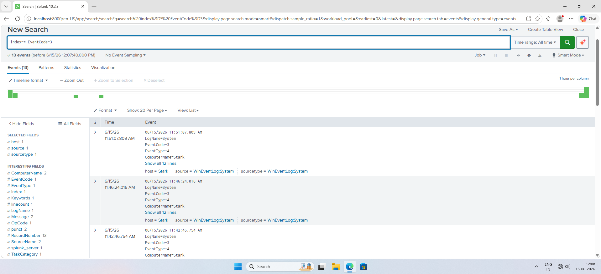

# Splunk Windows Authentication Monitoring

## Overview

This project demonstrates Windows authentication monitoring and threat detection using Splunk Enterprise in a VMware-based SOC lab. Windows Security and System event logs were collected using Splunk Universal Forwarder and analyzed using SPL queries to monitor authentication activity, detect failed logons, investigate privileged account usage, and identify security-relevant events.

---

## Objectives

- Collect Windows Security and System logs using Splunk Universal Forwarder.
- Monitor successful authentication events.
- Detect failed login attempts.
- Investigate failed logon details.
- Monitor privileged account activity.
- Demonstrate basic threat detection using Splunk SPL.

---

## Lab Environment

| Component | Details |
|------------|------------|
| Operating System | Windows 11 |
| SIEM Platform | Splunk Enterprise 10.2.3 |
| Log Forwarder | Splunk Universal Forwarder |
| Virtualization | VMware Workstation |
| Attack Machine | Kali Linux |

---

## Network Configuration

| Device | IP Address |
|----------|----------|
| Windows Host (STARK) | 192.168.110.129 |

---

# Lab Setup

Windows host configured with Splunk Universal Forwarder sending Security and System logs to Splunk Enterprise.



---

# Data Collection Verification

### SPL Query

```spl
index=*
| stats count by source
```

### Result

This query verifies that Windows Security, Application, and System logs are successfully being ingested into Splunk.



---

# Successful Logon Monitoring (Event ID 4624)

### SPL Query

```spl
index=* host=Stark EventCode=4624
| stats count by Account_Name
```

### Purpose

Event ID 4624 indicates a successful logon. Monitoring these events helps track user authentication activity and establish normal login behavior.

### Result



### Findings

- Successful logons generated by user and system accounts.
- Useful for user activity monitoring and baseline creation.
- Can help identify unusual authentication behavior.

---

# Failed Logon Detection (Event ID 4625)

### SPL Query

```spl
index=* host=Stark EventCode=4625
| stats count by Account_Name
```

### Purpose

Event ID 4625 indicates a failed authentication attempt. These events are important for identifying password guessing, brute-force attempts, and unauthorized access attempts.

### Result



### Findings

- Failed login attempts detected.
- Authentication failures can indicate malicious activity or invalid user access attempts.

---

# Failed Logon Investigation

### Event Details



### Investigation Results

| Field | Value |
|---------|---------|
| Event ID | 4625 |
| Account Name | fakeuser |
| Failure Reason | Unknown user name or bad password |
| Logon Type | 2 (Interactive) |
| Workstation Name | STARK |

### Analysis

The event shows an authentication attempt using a non-existent account named **fakeuser**. Such events are useful for identifying suspicious login activity and potential brute-force behavior.

---

# Privileged Logon Monitoring (Event ID 4672)

### SPL Query

```spl
index=* host=Stark EventCode=4672
```

### Purpose

Event ID 4672 is generated when special privileges are assigned to a new logon session. These events typically indicate administrative activity.

### Result



### Findings

- Privileged accounts successfully authenticated.
- Useful for monitoring administrator activity.
- Helps identify unauthorized privilege usage.

---

# Security Detection Query

### SPL Query

```spl
index=* EventCode=3
```

### Purpose

Demonstrates searching for specific security-relevant events to support threat hunting and detection activities.

### Result



### Findings

- Event filtering can be used to investigate targeted security events.
- SPL enables rapid analysis and detection workflows.

---

# Skills Demonstrated

- Splunk Enterprise Administration
- Splunk Search Processing Language (SPL)
- Windows Event Log Analysis
- Authentication Monitoring
- Failed Logon Detection
- Security Investigation
- Privileged Account Monitoring
- Threat Detection
- SIEM Operations
- Log Analysis

---

# Key Event IDs Used

| Event ID | Description |
|-----------|-------------|
| 4624 | Successful Logon |
| 4625 | Failed Logon |
| 4672 | Special Privileges Assigned |
| 3 | Security Detection Example |

---

# Author

**Mahadev Reddy**

SOC Analyst | Splunk | SIEM | Threat Detection | Security Monitoring
